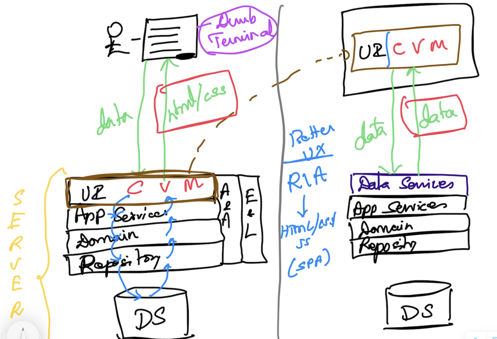

# React.js & Redux

## Software Requirements
- Node.js
- Chrome Browser
- Visual Studio Code (or any other editor)

## Pre-requisites
- Experience in JS (including ES6)

## CWA (Classical Web Apps) vs RIA (Rich Internet Apps)

## Why React.js?
- Rich Internet Applications

## JSX vs HTML
### JSX
- Every element has to have the corresponding close element
- Use "htmlFor" in place of "for" attribute
- Use "className" in place of "class" attribute

## View
- Presentation (VDOM (JSX)) + UI Behaviour + UI State = Component

## Component
- a function that returns VDOM
- component function names must start with uppercase

## Hooks 
- functions with name 'use'